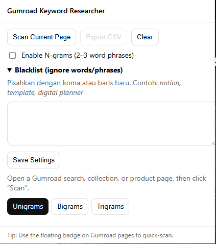

# Gumroad Keyword Researcher 🔍

A Chrome Extension for keyword research on Gumroad products.
This extension helps digital creators, sellers, and researchers **discover popular keywords** from **product titles, descriptions, and tags** on Gumroad.

 <!-- optional, replace with real screenshot -->

---

## ✨ Features

* **Keyword Scanner** → Extracts keywords from Gumroad product, search, or collection pages.
* **N-gram Analyzer** → Counts **Unigrams, Bigrams, and Trigrams** to identify frequent word combinations.
* **Keyword Blacklist** → Ignore generic words (e.g., "template", "digital", "notion") for cleaner results.
* **Floating Badge** → See quick keyword stats directly on Gumroad pages (no need to open popup).
* **CSV Export** → Download analyzed keywords for further research (Excel/Google Sheets).
* **Multi-source Scan** → Scan multiple products at once from Gumroad search or collections.

---

## 📦 Installation

1. Clone this repo or download as ZIP:

   ```bash
   git clone https://https://github.com/iseptianto/gumroadkeywordresearcher.git
   ```

   then open the folder.

2. Open Chrome and go to:

   ```
   chrome://extensions/
   ```

3. Enable **Developer Mode** (top-right).

4. Click **Load unpacked** → select this extension folder.

5. The extension icon will appear in the toolbar.

---

## 🚀 How to Use

1. Open **Gumroad** (search results, collections, or product pages).
2. Click the **Gumroad Keyword Researcher** icon.
3. Press **Scan Current Page** → keywords will appear in the popup.
4. Switch between tabs to see **Unigrams / Bigrams / Trigrams**.
5. (Optional) Add words to the **Blacklist** to skip them.
6. Press **Export CSV** to save the results.

---

## ⚙️ Options & Settings

* **Enable N-grams** → toggle analysis for 2–3 word phrases.
* **Blacklist** → add words/phrases you want to skip (comma- or line-separated).
* **Floating Badge** → shows quick stats (product count & top 5 keywords) in the corner of Gumroad pages.

---

## 📊 Example Output

| Term              | Count | In Tags |
| ----------------- | ----- | ------- |
| notion            | 35    | 20      |
| planner           | 28    | 15      |
| business template | 10    | 7       |
| social media      | 8     | 6       |

---

## 🔧 Folder Structure

```
gumroad-keyword-researcher/
│── manifest.json      # Chrome extension config
│── popup.html         # Main popup UI
│── popup.js           # Popup logic (scan, export, blacklist, n-grams)
│── content.js         # Floating badge + page communication
│── README.md          # Documentation
└── docs/preview.png   # (Optional) Extension screenshot
```

---

## 💡 Use Cases

* Sellers looking for **trending keywords** on Gumroad.
* Compare **competitors’ titles & tags**.
* Build **SEO strategies & product descriptions** for Gumroad/Etsy.
* Collect keyword data for further analysis (Excel/Google Sheets).

---

## 📌 Notes

* This extension **only reads public Gumroad pages**.
* It does not store personal data or make any changes to your Gumroad account.
* Safe limit: scans up to \~60 products per page by default.

---

## 📜 License

MIT License – free to use, modify, and extend.

---

Do you want me to also create a **sample `preview.png` mockup** (popup + badge) so your GitHub repo looks more professional?
